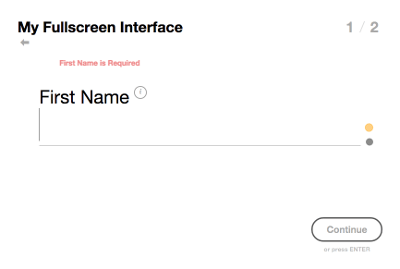

# Fullscreen Interface

Inspired by a project/article found on [codrops](http://tympanus.net/codrops/) posted by the talented Mary Lou [fullscreen-form-interface](http://tympanus.net/codrops/2014/07/30/fullscreen-form-interface/)

Although the look and feel is very similar, the code was converted to coffeescript and less for maintainability and many changes and additions were added for production quality use.

## Why a Fullscreen Interface?

1. Many Web Applications and Sites processes can be overwhelming to the average user, especially if they only visit/login occasionally.
2. Screens can sometimes become littered with fields, become confusing and/or even hard to program i.e. collapsing content appropriately, supporting mobile devices...
3. The Flow/Steps of an application, from a coding perspective, can get a little muddled i.e. multiple steps being done in the same screen so that the order of operations is preserved.
	To avoid this, and keep each screen separate, we can just link each Fullscreen Interface/Page/Screen to another creating an installation wizard kind of style. Creating
	this allows us as developers to essentially handhold the end user through a process, without having it feel that way.

## How to get what you need

1. nodejs ( maybe Io.js in the future ) >= v0.11.14 is required to run this. I recommend using [n](https://github.com/tj/n) to install as it doesn't get any easier.
2. Clone or Fork this repository.
3. Run the following command from within the cloned working directory "./app/bin/init" it will install all needed dependancies.
4. Run the command "gulp dev" <- there is no test as of yet haven't had time for unit tests yet.

## Examples?

There is an index.html file in the static directory that you can take a look at and manipulate; you can view/test in your browser by hitting [http://localhost:3000](http://localhost:3000) if your running using "gulp dev"

## Is there a non AMD module style

In short No. I could have provided one, but then would get "Is there an AMD module style?" this is the way I use the plugin and for maintainability/time constraints for me this is the way it is. But the beauty of git and opensource is that you can clone, fork etc. and make your own non AMD module version with minimal effort.

## Aww man! do I have to learn coffeescript or less to submit pull requests?

Although it is easier to integrate, no make the changes directly in javascript or css and I can backport it; it just may take longer.
For those dead set against coffeescript, it's not about coffeescript being the end all...it's about the time saved writing javascript.

## Feature Request or Bug

Create an issue or pull request, I'm pretty busy these days and cannot guarantee a prompt response, but I will get to it.

## Browser Support
This will only support newer HTML5 compliant browsers with javascript enabled and I have no plans to support older browsers such as ie8 etc. These things have been holding us back for years and don't intend to keep perpetuating the problem.

## Notes

My less is not perfect, nor is my coffeescript if you can write it better or wish to contribute please don't hesitate as I'm always looking to improve and learn new techniques.

